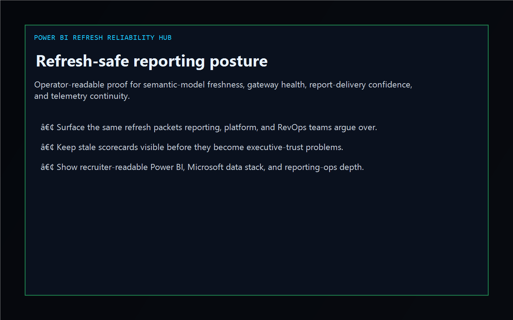
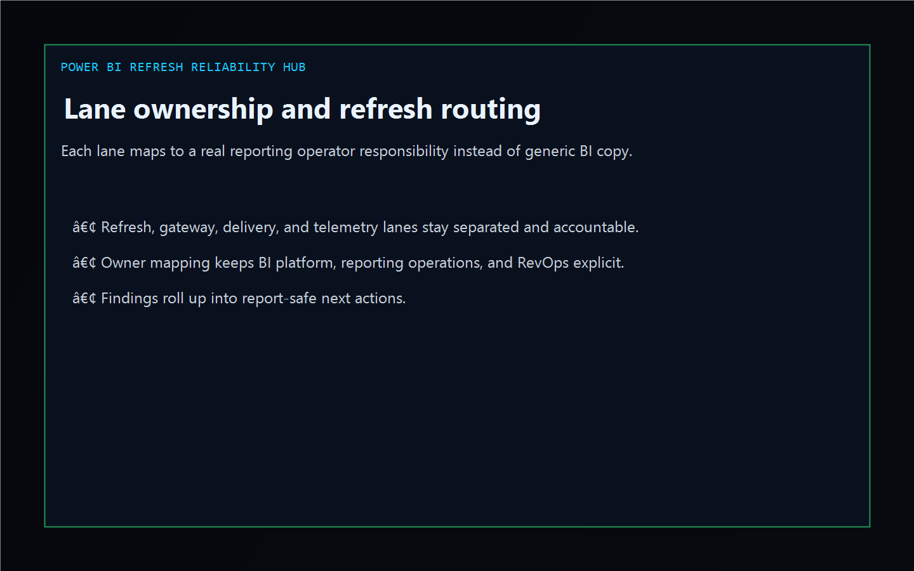
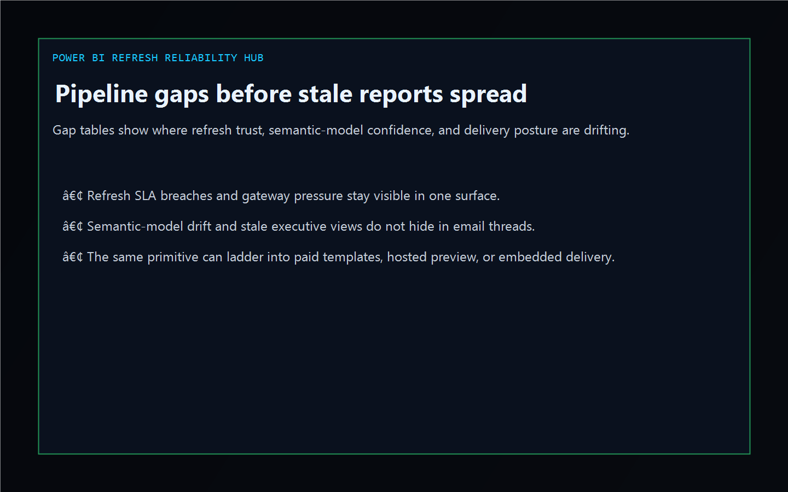
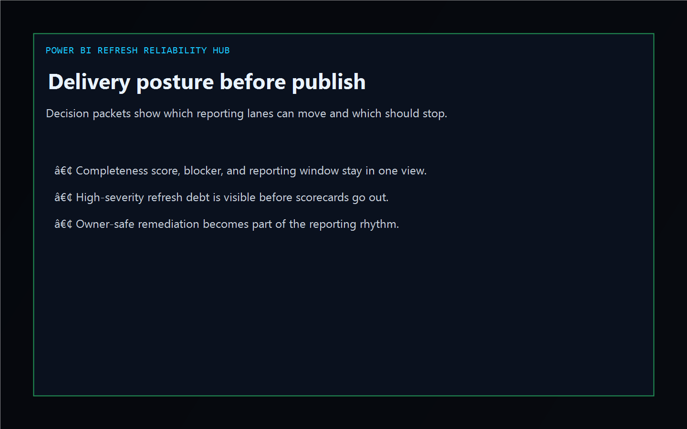

# powerbi-refresh-reliability-hub

[](https://github.com/mizcausevic-dev/powerbi-refresh-reliability-hub/actions/workflows/ci.yml)
[](https://github.com/mizcausevic-dev/powerbi-refresh-reliability-hub/actions/workflows/pages.yml)

Operator control plane for Power BI refresh reliability, gateway pressure, semantic-model drift, stale report-delivery risk, telemetry gaps, and remediation sequencing.

## Production status

| Aspect | Status |
|--------|--------|
| Deploy | Static prerender -> **https://powerbi.kineticgain.com/** |
| Data posture | Synthetic refresh snapshots and delivery packets only; no live tenant IDs, workspace secrets, or gateway credentials are committed |

## Why this matters

- Power BI breaks at refresh handoffs, gateway pressure, stale semantic models, and distribution timing long before anyone notices in the board deck.
- Recruiters looking for `Power BI / Microsoft data stack / reporting ops / semantic model governance` proof should see a real operator dashboard, not a keyword page.
- This repo turns refresh and report-delivery drift into one control plane for SLA containment, gateway health, semantic-model trust, telemetry continuity, and executive-report confidence.

## Why this matters (KG Embedded tie-back)

This repo demonstrates the refresh-reliability and delivery-control-plane primitive for Kinetic Gain Embedded: refresh snapshots, semantic-model evidence, gateway health, and remediation packets in one operator surface. Kinetic Gain Embedded extends this pattern into productized in-app reporting and BI reliability panels where teams need evidence-rich delivery governance without exposing raw admin consoles or live tenant credentials.

## What it shows

- `refresh-lane` visibility for refresh reliability, gateway health, delivery confidence, and telemetry governance
- `pipeline-gaps` detection for refresh breaches, gateway capacity risk, semantic-model drift, stale report distribution, telemetry gaps, and ownership handoff issues
- `delivery-posture` packets that tie owner, blocker, timing, and completeness together
- offline-safe analysis of captured Power BI refresh and workspace exports
- recruiter-facing Power BI / reporting ops / Microsoft BI proof that complements the Azure, AWS, GCP, reporting, and warehouse lanes

## Routes

- `/`
- `/refresh-lane`
- `/pipeline-gaps`
- `/delivery-posture`
- `/verification`
- `/docs`

## API

- `/api/dashboard/summary`
- `/api/refresh-lane`
- `/api/pipeline-gaps`
- `/api/delivery-posture`
- `/api/verification`
- `/api/sample`

## Screenshots






## CLI

```powershell
npx powerbi-refresh-reliability-hub fixtures/powerbi-refresh-hotspots.json `
  --format markdown `
  --fail-on-high
```

## Validation

- `npm run verify`
- `npm run prerender`
- `npm run render:assets`

## Local development

```powershell
cd powerbi-refresh-reliability-hub
npm install
npm run dev
```

Then open:

- [http://127.0.0.1:5524/](http://127.0.0.1:5524/)
- [http://127.0.0.1:5524/refresh-lane](http://127.0.0.1:5524/refresh-lane)
- [http://127.0.0.1:5524/pipeline-gaps](http://127.0.0.1:5524/pipeline-gaps)
- [http://127.0.0.1:5524/delivery-posture](http://127.0.0.1:5524/delivery-posture)

## Packaging

| Item | Value |
|---|---|
| License | `AGPL-3.0-or-later` |
| CNAME | `powerbi.kineticgain.com` |
| Live site | [https://powerbi.kineticgain.com/](https://powerbi.kineticgain.com/) |
| Deploy | Static prerender -> GitHub Pages |

## Docs

- [docs/KINETIC_GAIN_EMBEDDED.md](./docs/KINETIC_GAIN_EMBEDDED.md)

## Related

- [**`regulatory-reporting-mart`**](https://github.com/mizcausevic-dev/regulatory-reporting-mart) — reporting and warehouse proof
- [**`azure-landing-zone-drift-radar`**](https://github.com/mizcausevic-dev/azure-landing-zone-drift-radar) — Azure posture and drift lane
- [**`snowflake-cost-governance-studio`**](https://github.com/mizcausevic-dev/snowflake-cost-governance-studio) — warehouse cost governance

## Part of the Kinetic Gain Suite

Operator surface in the [Kinetic Gain Suite](https://suite.kineticgain.com/) — a portfolio of buyer-readable control planes spanning security posture, compliance evidence, data-platform governance, FinOps, reporting reliability, and operator workflows. Apex: [kineticgain.com](https://kineticgain.com/).
